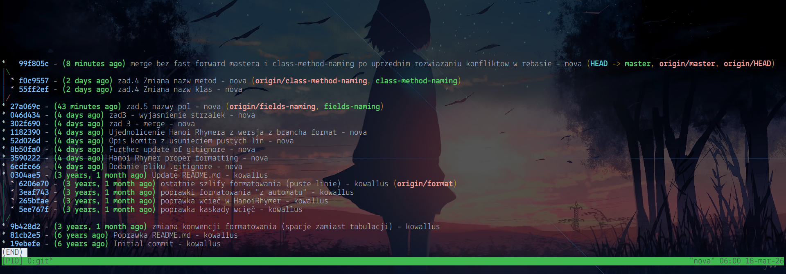
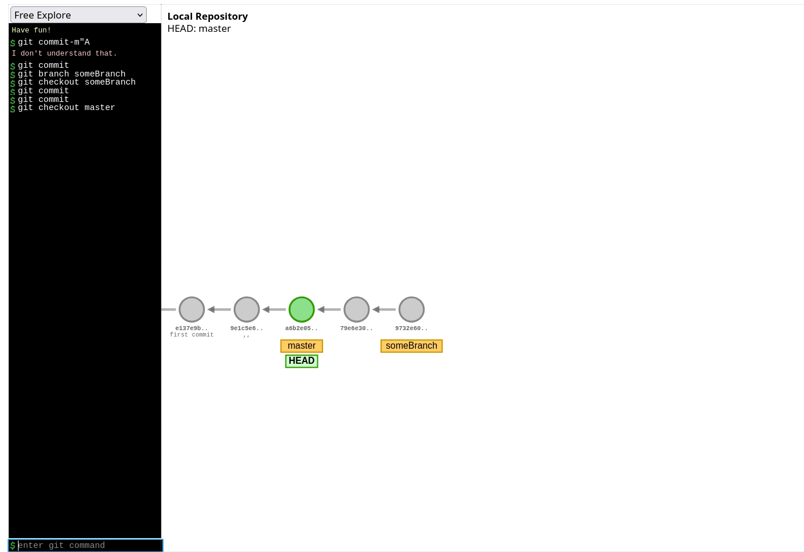
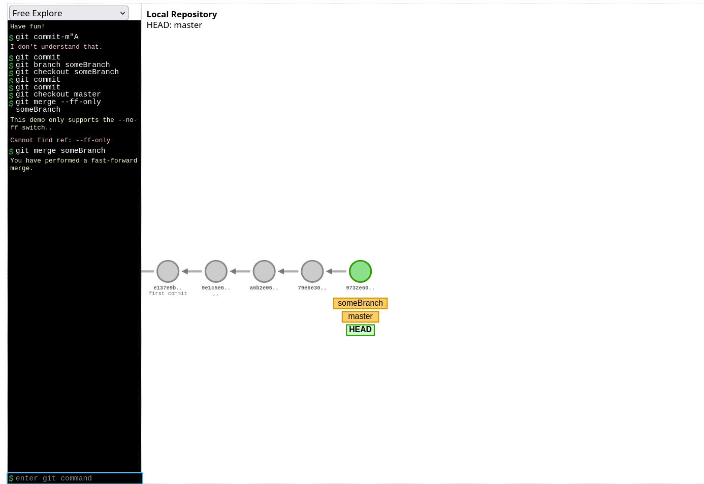
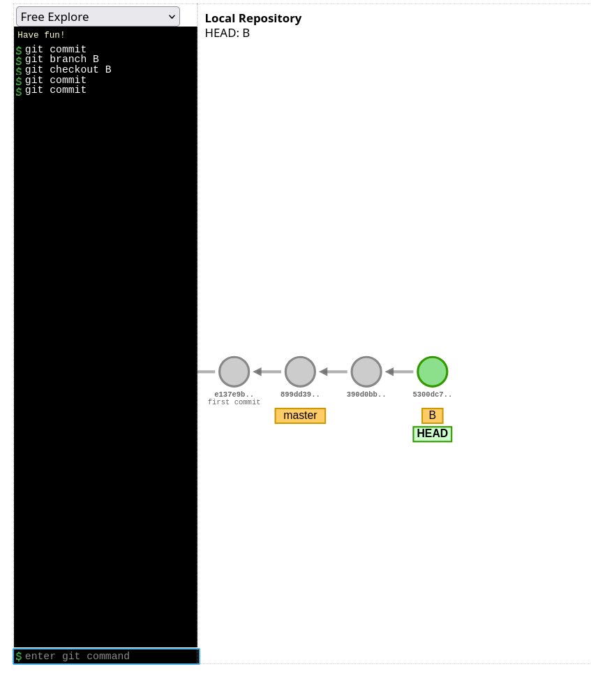
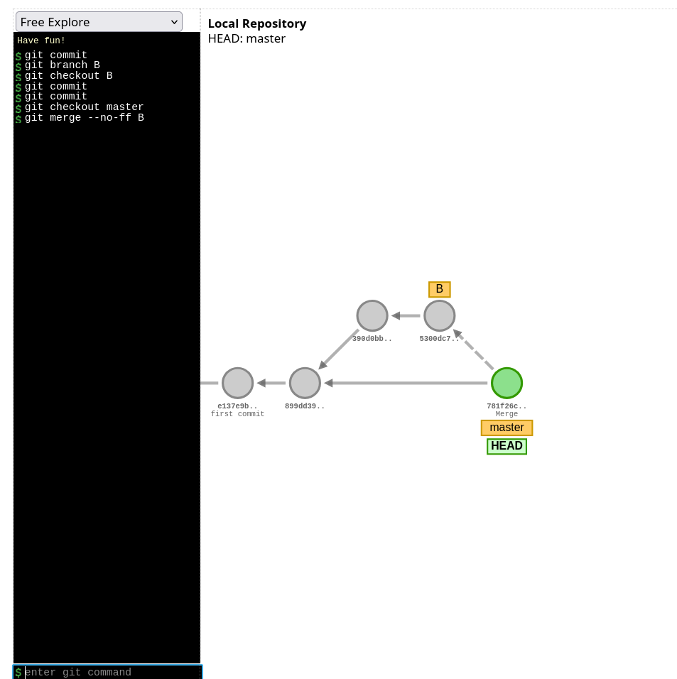
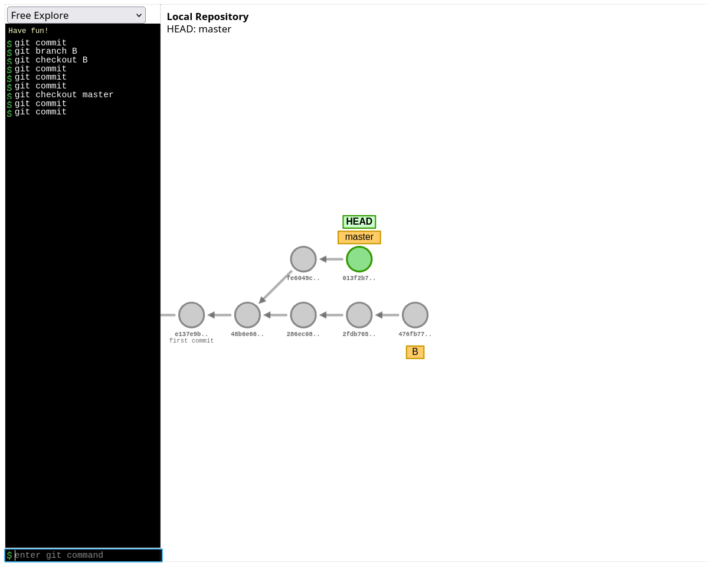
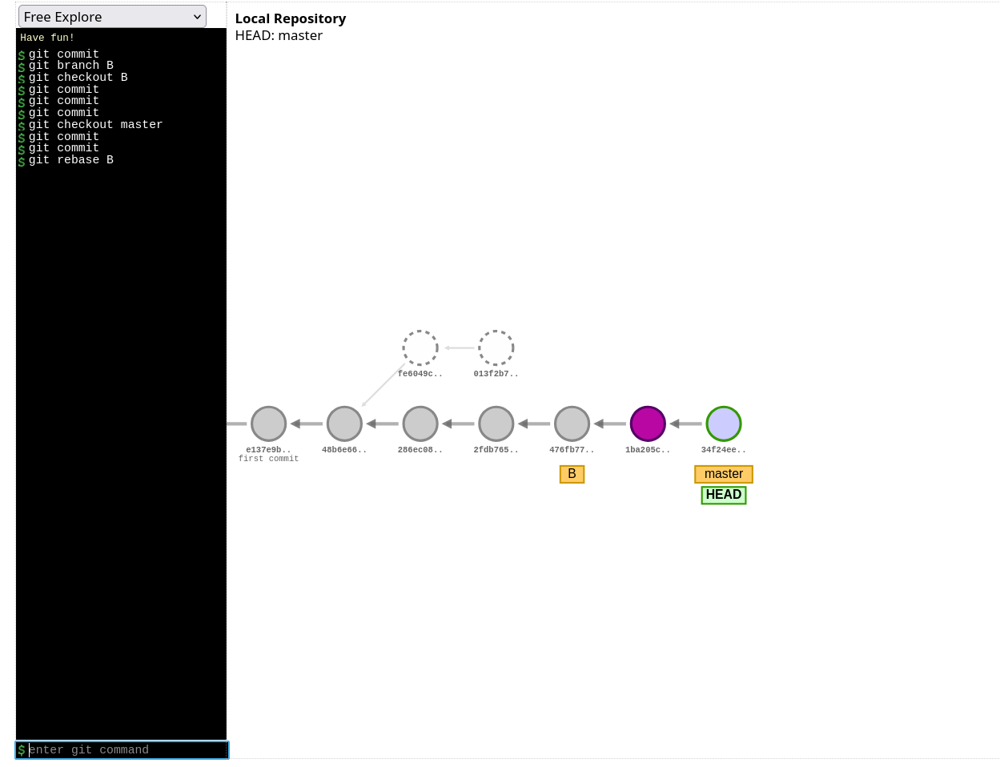

# Odpowiedzi do zadań Git

## Zadanie 3 – gałąź `format`

**Ostatni commit na branchu `format`:**  
- Zostały usunięte linie:
  - linia 10 i 16 w pliku `FIFORhymer.java`
  - tabulator w linii 11 w pliku `Node.java`

**Screenshot grafu commitów:**  

---

## Skróty klawiszowe

- **Alt + ←** – przejście wstecz w historii edytora/IDE  
- **Alt + →** – przejście do przodu w historii edytora/IDE  

---

## Merge – różnice użytych opcji

### 1. `git merge --ff-only`

- Wykonuje tylko fast-forward merge.  
- Jeśli fast-forward nie jest możliwy, merge nie zostanie wykonany.  
- Historia pozostaje liniowa.  

**Ilustracja przed i po merge:**  
  

---

### 2. `git merge --no-ff`

- Tworzy zawsze merge commit nawet jeśli możliwy był fast-forward.  
- Zachowuje informację o oddzielnym branchu.  
- Historia nie jest liniowa, widać strukturę branchy.  

**Ilustracja przed i po merge:**  
  

---

### 3. `git merge --squash`

- Scala zmiany z wybranego brancha w jeden commit.  
- Nie zachowuje historii oddzielnych commitów brancha.  
- W narzędziu wizualizującym (`https://git-school.github.io/visualizing-git/`) opcja `--squash` nie jest wspierana, dlatego nie ma dedykowanego diagramu.  

## Rebase

- `git rebase` przenosi commity z jednego branchu na szczyt innego branchu.  
- Tworzy nowe commity z nowymi SHA.  
- Pozwala utrzymać historię liniową bez merge commitów.  
- W przypadku konfliktów należy je rozwiązać ręcznie (`git add` lub `git rm`) i kontynuować rebase (`git rebase --continue`).  

**Ilustracja przed i po rebase:**  
  
  

